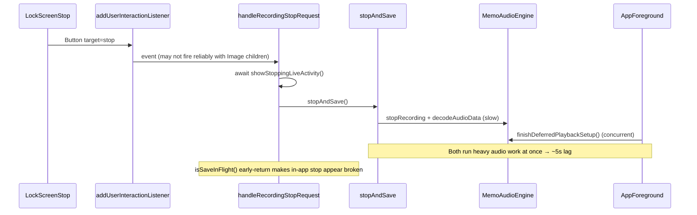

# Fix lock screen stop, lag, and timeline timer

## Root causes



| Issue | Cause |
|-------|-------|
| Stop button not working | `Button` uses custom `Image` children; prior working versions used `systemImage` + `labelsHidden()`. Custom children may not wire `LiveActivityIntent` reliably. |
| 5s lag after lock-screen stop attempt | Overlapping work: background `stopAndSave` (decode + file I/O) runs concurrently with `finishDeferredPlaybackSetup()` on foreground; in-app stop hits `isSaveInFlight()` and returns immediately while save is still running. |
| Timer shows 0 instead of timeline offset | `timerInterval` lower bound is `recordingStartedAt`, so it always counts from 0. For replace/stack modes, `startTime` (e.g. 10s) is ignored. |

## Planned changes

### 1. Fix stop button (icon-only, reliable intent)

**File:** [`src/widgets/RecordingLiveActivity.tsx`](src/widgets/RecordingLiveActivity.tsx)

Replace custom-children button with native icon path (visually identical, more reliable):

```tsx
<Button
  target="stop"
  label="Stop"
  systemImage="stop.circle.fill"
  modifiers={[buttonStyle('plain'), labelsHidden(), tint('#FFFFFF')]}
/>
```

No `Link` deep link (that foregrounds the app). Keep `target="stop"` + `LiveActivityIntent`.

### 2. Unify stop entry points

**Files:** [`app/memo/[id].tsx`](app/memo/[id].tsx), [`src/widgets/recordingLiveActivityController.ts`](src/widgets/recordingLiveActivityController.ts)

- Route in-app stop (`handleStopRecording`) through `handleRecordingStopRequest(engine)` instead of calling `stopAndSave` directly.
- After save, memo screen already updates via existing `subscribeRecordingSave` listener—keep that; only add UI state reset in the listener (already present).
- This ensures lock-screen and in-app stop share the same session hydration, live-activity teardown, and background/foreground logic.

### 3. Fix lag: serialize saves and deferred setup

**File:** [`src/recording/activeRecordingSession.ts`](src/recording/activeRecordingSession.ts)

- Export `awaitSaveInFlight(): Promise<RecordingSaveResult | null | void>` that awaits the current `saveInFlight` promise if one exists.
- In `handleRecordingStopRequest` and memo-screen stop: **await** `awaitSaveInFlight()` instead of returning early when `isSaveInFlight()`.

**File:** [`src/widgets/recordingLiveActivityController.ts`](src/widgets/recordingLiveActivityController.ts)

- Make `showStoppingLiveActivity()` fire-and-forget (`void active.update(...)`)—do not `await` it before saving.

**File:** [`src/audio/MemoAudioEngine.ts`](src/audio/MemoAudioEngine.ts)

- Add in-flight guard to `finishDeferredPlaybackSetup()` (skip if already running; dedupe concurrent calls).
- On `AppState` → `active` and in [`app/_layout.tsx`](app/_layout.tsx) startup: **await `awaitSaveInFlight()` first**, then call `finishDeferredPlaybackSetup()`. This prevents decode/reload from racing with an in-progress background save.

**Preserve (do not change):**
- `deferPlaybackSetup` when backgrounded (fixes `CannotInterruptOthers`)
- `prepareRecordingRoute()` immediately before `recorder.start()` (fixes Playback-category start failure)

### 4. Fix timer to show timeline-absolute elapsed time

**File:** [`src/widgets/RecordingLiveActivity.tsx`](src/widgets/RecordingLiveActivity.tsx)

Offset the `timerInterval` lower bound by `startTime` so the display reflects position on the memo timeline:

```tsx
// startTime is in seconds (0 for new recordings, 10 for replace-at-10s, etc.)
const offsetMs = props.startTime * 1000;
const intervalStart = new Date(props.recordingStartedAt - offsetMs);
const intervalEnd = new Date(props.recordingStartedAt + 24 * 60 * 60 * 1000);

<Text timerInterval={{ lower: intervalStart, upper: intervalEnd }} countsDown={false} ... />
```

- New recording (`startTime = 0`): shows `00:00` counting up (unchanged).
- Replace from 10s (`startTime = 10`): shows `00:10` counting up immediately.
- Still uses native `timerInterval` so it auto-updates on the lock screen without app pushes.

`startTime` is already persisted in [`activeRecordingSession`](src/recording/activeRecordingSession.ts) and passed through [`recordingLiveActivityController.ts`](src/widgets/recordingLiveActivityController.ts) via `buildProps`.

### 5. Regression safety

Changes are scoped to:
- Live Activity UI + controller
- Stop orchestration (not recording start/stop audio core logic beyond serialization)
- No changes to `LoopRegionBar`, track editor, or playback

**Manual test checklist after rebuild:**
1. New recording → lock screen timer starts at `00:00`, updates while locked
2. Replace from ~10s → lock screen timer starts at ~`00:10`
3. Lock screen stop → saves silently, widget dismisses, no app open
4. Lock screen stop attempt → open app → in-app stop responds within ~1s (not 5s)
5. In-app stop still works on first tap
6. Start recording after background stop works without app restart

Rebuild required: `npm run prebuild:ios && npx expo run:ios --device`
