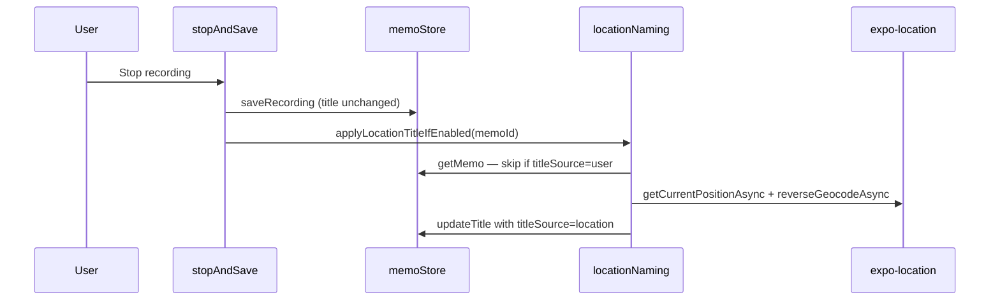

# Location-based auto naming

## How Apple implements it

Apple's **Location-based Naming** (introduced in iOS 12) is a system-level feature, not public API. Under the hood it uses:

1. **Core Location** to get the device's current coordinates (Wi-Fi/cell-assisted, not just GPS)
2. **Reverse geocoding** via `CLGeocoder` (being superseded by MapKit's `MKReverseGeocodingRequest` in newer iOS) to convert coordinates into human-readable place names
3. A **proprietary title heuristic** that picks the most useful label from the placemark — neighborhood, street, landmark, park, or nearby business
4. **Duplicate suffixing** when multiple recordings share the same place ("Central Park", "Central Park 2", …)
5. **Fallback** to "New Recording" / sequential numbering when location is denied, unavailable, or geocoding fails
6. A **Settings toggle** (Settings → Voice Memos → Location-based Naming) plus "While Using the App" location permission

We cannot replicate Apple's exact POI/landmark selection logic (it uses private MapKit data), but we can get **very close** using `expo-location`'s `reverseGeocodeAsync`, which wraps the same system geocoder on iOS.

---

## Current state in this project

| Area | Status |
|------|--------|
| Default title | Timestamp string via [`createDefaultTitle()`](src/utils/format.ts) — e.g. `"New Recording Jul 13, 4:24 PM"` |
| When set | At memo creation in [`createMemo()`](src/storage/memoStore.ts), before recording starts |
| Post-recording rename | None — title never auto-updates after save |
| Manual rename | [`updateTitle()`](src/storage/memoStore.ts) called from [`RecordingRow`](src/components/RecordingRow.tsx) and [`app/memo/[id].tsx`](app/memo/[id].tsx) |
| Location APIs | None — no `expo-location`, no geocoding, no location permission in [`app.json`](app.json) |
| Settings UI | None — no app-level preferences storage |

**Integration point:** rename on **recording stop**, only for `mode: 'new'` sessions. Hook into [`stopAndSave()`](src/recording/activeRecordingSession.ts) after `saveRecording()` succeeds.

---

## Viability assessment

**Yes — viable**, with these constraints:

- **iOS-only app** — `expo-location` + `reverseGeocodeAsync` map directly to Apple's geocoder
- **Low complexity** — one new dependency, one permission string, ~150 lines of logic
- **Async / non-blocking** — geocoding runs after save; recording UX is unaffected
- **Cannot match Apple 100%** — POI/business names depend on Apple's private ranking
- **Privacy** — location appears in the memo title; must be opt-out-able (enabled by default per your preference)
- **Indoor accuracy** — Wi-Fi-assisted location can mislabel; same quirk Apple users report

---

## Proposed architecture



---

## Manual rename protection (explicit requirement)

Auto-naming must **never overwrite a user-chosen title**. String heuristics (e.g. checking for `"New Recording"`) are fragile; use an explicit field on the memo instead.

### `titleSource` field on `Memo`

Add to [`src/storage/types.ts`](src/storage/types.ts):

```ts
titleSource?: 'default' | 'location' | 'user';
```

| Value | Meaning | Auto-rename allowed? |
|-------|---------|---------------------|
| `'default'` (or absent) | Placeholder from `createDefaultTitle()` at creation | Yes |
| `'location'` | Set by location-based naming | Yes (re-geocode on stop is idempotent; only runs once per new memo) |
| `'user'` | Set by manual rename via `updateTitle` | **No — never overwrite** |

### Wiring

- **`createMemo()`** — omit `titleSource` (treated as `'default'`)
- **`updateTitle()`** — always set `titleSource: 'user'` (covers both [`RecordingRow`](src/components/RecordingRow.tsx) and memo editor rename)
- **`applyLocationTitleIfEnabled()`** — at start, `getMemo()` and **return early if `titleSource === 'user'`**
- **Race condition** — if user renames while geocode is in flight, `updateTitle` sets `titleSource: 'user'` first; geocode completion re-reads memo and skips
- **`duplicateMemo()`** — copy inherits source title; set `titleSource: 'user'` if duplicating a user-named memo, or `'default'` if duplicating an auto-named one (or always `'user'` since duplicate title is explicit — simplest: always `'user'` for copies)

### What this protects

- User renames during recording → geocode on stop is skipped
- User renames after auto-location title applied → future auto-rename attempts skipped (only relevant if we ever add re-geocode)
- User renames before geocode returns → geocode completion sees `titleSource: 'user'` and skips

---

## New files

- [`src/location/locationNaming.ts`](src/location/locationNaming.ts) — permission check, geocode, title heuristic, duplicate suffix, `titleSource` guard
- [`src/location/formatLocationTitle.ts`](src/location/formatLocationTitle.ts) — pure function to pick best title from `LocationGeocodedAddress` (testable)
- [`src/settings/appSettings.ts`](src/settings/appSettings.ts) — persist `locationBasedNaming: boolean` (default `true`) via `expo-file-system` JSON

### Title heuristic

From `LocationGeocodedAddress`, pick the first non-empty value:

1. `name` — landmark / POI / business
2. `street` — with `streetNumber` prefixed if available
3. `district` — neighborhood
4. `subregion`
5. `city`
6. Fallback: keep existing title (do not overwrite)

**Duplicate handling:** query existing memo titles via `listMemos()`; if `"Central Park"` exists, use `"Central Park 2"`, etc.

---

## Modified files

| File | Change |
|------|--------|
| [`package.json`](package.json) | Add `expo-location` |
| [`app.json`](app.json) | Add `expo-location` config plugin + `NSLocationWhenInUseUsageDescription` |
| [`src/storage/types.ts`](src/storage/types.ts) | Add `titleSource?: 'default' \| 'location' \| 'user'` |
| [`src/storage/memoStore.ts`](src/storage/memoStore.ts) | `updateTitle` sets `titleSource: 'user'`; location naming sets `titleSource: 'location'` |
| [`src/recording/activeRecordingSession.ts`](src/recording/activeRecordingSession.ts) | After `saveRecording` in `mode === 'new'`, fire-and-forget `applyLocationTitleIfEnabled(memoId)` |
| [`app/index.tsx`](app/index.tsx) or new settings screen | "Location-based Naming" toggle |

---

## Edge cases

- **Geocode slow/fails** — keep placeholder title; no user-facing error
- **Stack/replace modes** — skip (only rename brand-new memos)
- **Live Activity** — title updates after stop; activity already dismissed
- **Existing memos** — `titleSource` absent is treated as `'default'`; no retroactive renaming

---

## Out of scope

- Storing raw lat/lng on the memo
- Background location
- macOS support
- Renaming existing recordings retroactively

---

## Effort estimate

~1 day: dependency + permission setup, `titleSource` field, naming module, stop-hook integration, settings toggle, unit tests, device verification.
