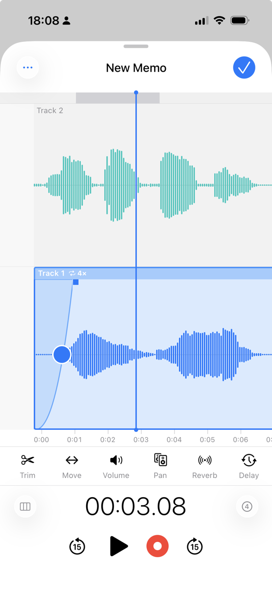
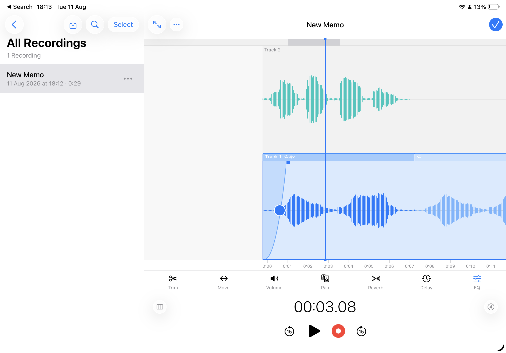

# Voice Memos Plus

<p align="center">
  
  
</p>

Voice Memos Plus is a multi-track voice recorder that keeps the familiar Voice Memos flow and adds the tools to build richer takes: stack layers, edit waveforms, add effects, loop regions, and keep time with a metronome and grid. Recordings stay on your device.

**[Product site](https://eduardo-dangelo.github.io/voice-memos-plus/)** · **[Privacy](https://eduardo-dangelo.github.io/voice-memos-plus/privacy.html)**

iOS app built with Expo SDK 56 and `react-native-audio-api`.

## Features

- Multi-track stack with overdub and monitor mix
- Waveform editor: scrub, trim, replace, and fade
- Per-layer effects (EQ, reverb, delay, and more)
- Timeline loop and loop-track
- Metronome, BPM, precount, and beat grid
- Recordings list with search, select, and inline playback
- Share, rename, duplicate, and delete
- Local storage (`manifest.json` + per-layer audio)

## Requirements

- macOS with Xcode
- Node.js 20+
- iOS Simulator or physical device
- **Development build required** (`react-native-audio-api` is not available in Expo Go)

## Setup

```bash
npm install
npx expo prebuild --platform ios
npx expo run:ios
```

If native binaries fail on first build:

```bash
node node_modules/react-native-audio-api/scripts/download-prebuilt-binaries.sh ios
npx expo run:ios
```

If you see a sandbox error like `deny(1) file-write-create .../resources-to-copy-VoiceMemosPlus.txt`, Xcode's User Script Sandboxing is blocking CocoaPods. The project's `ios/Podfile` already disables this in `post_install`. If it returns after `expo prebuild`, run:

```bash
cd ios && pod install && cd ..
npx expo run:ios
```

Or in Xcode: **Build Settings → User Script Sandboxing → No**.

## Project structure

```
app/                 Expo Router screens (list + editor)
src/audio/           Audio engine, waveform utilities
src/storage/         Memo CRUD and file paths
src/components/      UI components
```

## Manual test checklist

- [ ] Record from FAB → memo appears in list with correct duration
- [ ] Inline play/pause and skip ±15s from list row
- [ ] Editor scrub, trim handles, playback respects trim region
- [ ] Replace re-records selected region and updates waveform
- [ ] Share exports a playable M4A
- [ ] Rename, duplicate, delete, and search work
